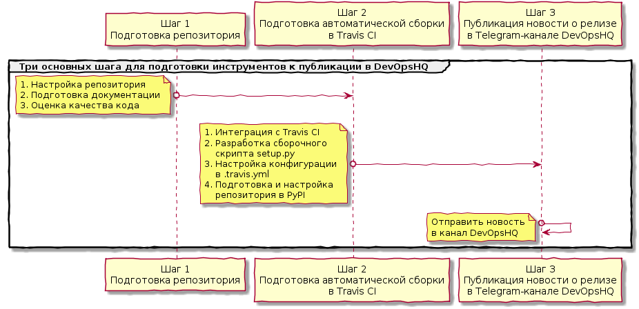

ExampleProject
==============
This is simple example of project in DevOpsHQ Community with basic functionality.
See english instruction here: https://github.com/devopshq/ExampleProject/blob/master/README_EN.md

[](https://travis-ci.org/devopshq/ExampleProject) [](https://www.codacy.com/app/tim55667757/ExampleProject/dashboard) [](https://www.codacy.com/app/tim55667757/ExampleProject/dashboard) [](https://pypi.python.org/pypi/dohq-example-project) [](https://github.com/devopshq/ExampleProject/blob/master/LICENSE)

***Содержание:***
- [Введение](#Introduction)
- [Подготовка репозитория](#Preparing-repo)
     - [Подготовка документации](#Preparing-doc)
     - [Оценка качества кода](#Codacy)
- [Подготовка автоматической сборки в Travis CI](#Travis-CI)
     - [Разработка сборочного скрипта setup.py](#Setup)
     - [Настройка конфигурации в .travis.yml](#Configuration)
     - [Подготовка и настройка репозитория в PyPI](#PyPI)
- [Публикация новости о релизе в Telegram-канале DevOpsHQ](#News)


# Введение <a name="Introduction"></a>

**ExampleProject** — это пример простого проекта в ообществе DevOpsHQ с базовой функциональностью. Документация содержит в себе примеры и рекомендации для самостоятельной организации сборки любого нового проекта в сообществе DevOpsHQ. Сам проект — имеет типовую структуру и сборку в Travis CI. Фактически, достаточно скопировать этот проект и заменить некоторые настройки, руководствуясь комментариями ниже. 

Подготовка любого нового проекта состоит из шагов, представленных на схеме ниже:




# Подготовка репозитория <a name="Preparing-repo"></a>

1. Обсудить и согласовать с [Timur Gilmullin](https://github.com/Tim55667757) или [Alexander Pazdnikov](https://github.com/apazdnikov) выкладку нового проекта в https://github.com/devopshq. После этого будет создан и настроен репозиторий и типовые группы доступа, выданы права owner на проект.

2. В настройках проекта (Settings) в разделе Options разрешается подключать только фичу (в разделе Features) Issue. Wikis и Projects в проектах на GitHub в сообществе DevOpsHQ мы не ведём.

3. Там же в настройках проекта в разделе Branches выбираем дефолтовую ветку master.

4. На вкладке проекта Issues в разделе Labels создаём только две метки: **Error** и **Task**, остальные удаляем. Milestones создавайте на своё усмотрение, например, если у вас планируется крупная фича к разработке, состоящая из множества зависимых тасков.

5. Юнит-тесты формата pytest должны располагаться в каталоге **./tests** в корне проекта.

6. При инициализации репозитория следует использовать только **MIT-лицензию** под именем **LICENSE** следующего содержания (обновив год):

```
MIT License
 
Copyright (c) 2017 Open DevOps Community
 
Permission is hereby granted, free of charge, to any person obtaining a copy
of this software and associated documentation files (the "Software"), to deal
in the Software without restriction, including without limitation the rights
to use, copy, modify, merge, publish, distribute, sublicense, and/or sell
copies of the Software, and to permit persons to whom the Software is
furnished to do so, subject to the following conditions:
 
The above copyright notice and this permission notice shall be included in all
copies or substantial portions of the Software.
 
THE SOFTWARE IS PROVIDED "AS IS", WITHOUT WARRANTY OF ANY KIND, EXPRESS OR
IMPLIED, INCLUDING BUT NOT LIMITED TO THE WARRANTIES OF MERCHANTABILITY,
FITNESS FOR A PARTICULAR PURPOSE AND NONINFRINGEMENT. IN NO EVENT SHALL THE
AUTHORS OR COPYRIGHT HOLDERS BE LIABLE FOR ANY CLAIM, DAMAGES OR OTHER
LIABILITY, WHETHER IN AN ACTION OF CONTRACT, TORT OR OTHERWISE, ARISING FROM,
OUT OF OR IN CONNECTION WITH THE SOFTWARE OR THE USE OR OTHER DEALINGS IN THE
SOFTWARE.
```


## Подготовка документации <a name="Preparing-doc"></a>

1. Документация к проекту на английском языке должна вестись в файле **README.md** формата **markdown**, который должен располагаться в корне репозитория в каждой ветке. Версионирование и изменения в документацию вносятся как в обычный код, вместе с отдельными комитами в соответствующую ветку. Документация на русском ведётся аналогично в файле **README_RUS.md**.   

2. На вкладке Settings проекта в разделе Options подключаем [GitHub Pages сервис](https://pages.github.com/): 
    * В качестве Source выбираем master branch. То есть, актуальная документация всегда будет браться для сайта на GitHub Pages из этой ветки.
    * В пункте Theme chooser нажимаете кнопку Change theme и выбираете любую понравившуюся тему для сайта с документацией. Обычно в DevOpsHQ мы используем "Hacker theme". 
   
   После этого в ветке master в корне репозитория будет создан файл с настройками для GitHub Pages **_config.yml**.

3. Если документация объёмная (больше одной страницы или экрана текста), то рекомендуется добавить в неё содержание со ссылками. 

[Markdown](https://ru.wikipedia.org/wiki/Markdown) (маркдаун) — облегчённый язык разметки, созданный с целью написания максимально читаемого и удобного для правки текста, но пригодного для преобразования в языки для продвинутых публикаций (HTML, Rich Text и др.).

Для работы с ним есть множество онлайн-инструментов, в том числе с инструкцией по правильной разметке текста, например: 
* [Dillinger](http://dillinger.io/) — в этом онлайн-редакторе можно на лету форматировать markdown-файлы и смотреть результат визуализации разметки.

Также и GitHub поддерживает автоматическое отображение README.md файлов в формате markdown.

В маркдаун-документацию можно добавлять индекс (оглавление) на внутренние якоря в документе. При этом ссылки в таком оглавлении будут кликабельными, как в обычном html-документе. Это полезно для больших markdown-документов.

Для того, чтобы сделать оглавление:

1. Пишем в оглавлении ссылку вида:

   **\[HEADER\](#anchor_name)**

2. Рядом с нужным местом (заголовком) в документе добавляем обычный html-якорь:

   **\<a name="anchor_name"\>\</a\> HEADER**

Альтернативный вариант:

1. Пишем в оглавлении ссылку вида: 

   **\[Long Header\](#long-header)**

2. В тексте заголовок должен быть такой же, как в квадратных скобках выше:
   
   **Long Header**


## Оценка качества кода <a name="Codacy"></a>

Качество кода автоматически отслеживается [сервисом Codacy](https://www.codacy.com/). Для его настройки:

1. Авторизуйтесь со своей GitHub-учёткой, или учёткой, созданной в самом сервисе: https://www.codacy.com/

2. Нажмите кнопку Add project.

3. Выберете проект из списка или добавьте URL на код в GitHub-е.

4. После обработки проекта он появится на дашборде.

5. Настройка автоматического подсчёта покрытия кода тестами (Coverage) будет реализована позже в разделе про Travis CI сборки.

5. Перейдите в настройки проекта (кнопка settings в меню слева) и скопируйте Codacy Badge для проекта в формате markdown. Это ссылка на оценку качества кода.

7. Вставьте ссылку на значок с оценкой качества кода в документацию README.md в самом начале, сразу после заголовка с названием проекта. Она должна иметь вид, похожий на этот:

   \[\](https://www.codacy.com/app/**tim55667757/FuzzyClassificator**/dashboard)
   
   Выделенное длинное число — это код значка для проекта в Codacy (можно узнать в настройках Settings - General - Codacy Badge), а выделенная часть ссылки — это ваш логин и имя проекта в Codacy.

8. После того, как любая сборка запушит первый раз данные по тестовому покрытию, можно также вставить ссылку на значок с оценкой покрытия кода тестами. Ссылка должна иметь вид, похожий на этот:

   \[\](https://www.codacy.com/app/**tim55667757/FuzzyClassificator**/dashboard)

   Выделенное длинное число — это код проекта в Codacy (его можно узнать в настройках Settings — General — Codacy Badge), а выделенная часть ссылки — это ваш логин и имя проекта в Codacy.


# Подготовка автоматической сборки в Travis CI <a name="Travis-CI"></a>

Подготовка сборки python-кода в [Travis CI](https://travis-ci.org/devopshq) состоит из нескольких основных шагов:

* разработки сборочного скрипта **setup.py** (для стандартного сборщика python из библиотеки setuptools), 
* настройки конфигурации в **.travis.yml** (стандартный файл конфигурации для Travis CI),
* настройки **репозитория в PyPI**.

Для начала работы с Travis CI включите интеграцию в вашем GitHub проекте: для этого перейдите в Travis CI по ссылке https://travis-ci.org/profile/devopshq и включите интеграцию вашего нового проекта с GitHub. Для этой операции необходимы админские права в сообществе DevOpsHQ. 


## Разработка сборочного скрипта setup.py <a name="Setup"></a>

Скрипт **setup.py** используется стандартным сборщиком python из библиотеки setuptools для обеспечения локальной сборки инструмента в пакет. Обычно, для локального билда и установки вашего инструмента в библиотеки локального python используют команду: python setup.py install. Этот же самый принцип использует Travis CI для обеспечения сборки и дальнейшей упаковки пакета, например, в .tar.gz или wheel-файл и загрузки в PyPI.

Добавьте файлы **setup.py** и **setup.cfg** в корень своего репозитория. А также добавьте пустой файл **\_\_init\_\_.py** в каталог со скриптами, который вы хотите сделать пакетом и который после сборки можно будет импортировать в других проектах.

В **setup.cfg** достаточно добавить две строчки, с указанием того, где искать документацию:

    [metadata]
    description-file = README.md

Ниже представлен готовый **пример файла setup.py** с минимальным набором настроек для локальной сборки пакета. Внимательно читайте комментарии. Достаточно скопировать его к себе и он должен заработать с небольшими исправлениями:

```python
#!/usr/bin/env python
# -*- coding: utf-8 -*-
 
 
from setuptools import setup
import os
 
__version__ = '1.0'  # Здесь можно менять глобальный мажор.минор вашего инструмента. Итоговая версия после сборки будет выглядеть так: [major.minor].[build] для релизных сборок и [major.minor.dev]build для нерелизных.
# В дальнейшем узнать версию вашего установленного инструмента внутри программы возможно используя метод, аналогичный этому:
# https://github.com/devopshq/FuzzyClassificator/blob/master/FuzzyClassificator.py#L27
# import pkg_resources  # часть стандартной библиотеки setuptools
# version = pkg_resources.get_distribution('YourProject').version
  
# Логика версионирования в зависимости от веток настраивается ниже:
if 'TRAVIS_BUILD_NUMBER' in os.environ and 'TRAVIS_BRANCH' in os.environ:
    print("This is TRAVIS-CI build")
    print("TRAVIS_BUILD_NUMBER = {}".format(os.environ['TRAVIS_BUILD_NUMBER']))
    print("TRAVIS_BRANCH = {}".format(os.environ['TRAVIS_BRANCH']))
 
    __version__ += '.{}{}'.format(
        '' if 'release' in os.environ['TRAVIS_BRANCH'] or os.environ['TRAVIS_BRANCH'] == 'master' else 'dev',
        os.environ['TRAVIS_BUILD_NUMBER'],
    )
 
else:
    print("This is local build")
    __version__ += '.localbuild'  # set version as major.minor.localbuild if local build: python setup.py install
 
print("YourProject build version = {}".format(__version__))  # Перед сборкой выведется сообщение о том, какая версия собирается
 
#  Это основной раздел настроек setuptools для сборки вашей программы
setup(
    name='YourProject',  # имя проекта под которым люди будут искать вашу программу в PyPI и инсталлить через "pip install YourProject"
 
    version=__version__,
 
    description='Short description of your project.',  # короткое описание проекта - отображается рядом с пакетом в PyPI
 
    long_description='You can see detailed user manual here: https://devopshq.github.io/YourProject/',  # подробная документация должна быть доступна в GitHub Pages по этой ссылке
 
    license='MIT',  # только MIT лицензия для Open DevOps Community
 
    author='Open DevOps Community',  # укажите имя основного автора, либо укажите Open DevOps Community
 
    author_email='tim55667757@gmail.com',  # е-mail автора либо ссылка на Open DevOps Community
 
    url='https://devopshq.github.io/YourProject/',  # сюда пишем ссылку на GitHub Pages или другой сайт с документацией
 
    download_url='https://github.com/devopshq/YourProject.git',  # здесь указываем ссылку на проект в GitHub
 
    entry_points={'console_scripts': ['MainScript = MainScript:Main']},  # Точка входа указывает на основной метод, который нужно запустить при запуске программы из консоли. Например, если основной модуль называется MainScript, то в данном примере будет запущен метод Main() этого скрипта, если вы наберёте в консоли команду "MainScript".
 
    classifiers=[  # все допустимые классификаторы для PyPI подробно перечислены на страничке: https://pypi.python.org/pypi?%3Aaction=list_classifiers
        'Development Status :: 5 - Production/Stable',
        'Environment :: Console',
        'Intended Audience :: Science/Research',
        'Topic :: Scientific/Engineering :: Artificial Intelligence',
        'License :: OSI Approved :: MIT License',
        'Natural Language :: English',
        'Programming Language :: Python :: 3.6',
    ],
 
    keywords=[  # перечислите все ключевые слова, которые ассоциируются с вашим инструментом, каждое слово отдельной записью
        'keyword 1',
        'keyword 2',
    ],
 
    packages=[  # необходимо перечислить ВСЕ каталоги с пакетами, если они присутствуют в вашем проекте, либо оставить '.', что будет указывать на то, что корень проекта сам является пакетом (в корне должен быть __init__.py)
        '.',
    ],
 
    setup_requires=[  # необходимо перечислить ВСЕ библиотеки, от которых зависит сборка вашего инструмента
    ],
 
    tests_require=[  # необходимо перечислить ВСЕ библиотеки, которые должны быть установлены для запуска тестов
        'pytest',
    ],
 
    install_requires=[  # необходимо перечислить ВСЕ библиотеки, от которых зависит ваш инструмент (requirements), кроме стандартных библиотек, и они будут установлены автоматически при установке вашего инструмента
    ],
 
    package_data={  # необходимо перечислить ВСЕ файлы, которые должны войти в итоговый пакет, например:
        '': [
            './someothermodule/*.py',  # если проект содержит другие модули, их и все входящие в них файлы тоже нужно перечислить
 
            './tests/*.py',  # все юнит-тесты, если вы хотите, чтобы люди могли их запускать после установки вашей библиотеки
            'MainScript.py',  # основной скрипт вашего приложения и все остальные файлы должны быть указаны аналогично
 
            'LICENSE',  # файл лицензии нужно добавить в пакет
            'README.md',  # файл документации нужно добавить в пакет
        ],
    },
 
    zip_safe=True,
)
```

После разработки скрипта зарегистрируйте новый проект в PyPI (учётку devopshq могут использовать админы сообщества):

    python setup.py register -r pypi

***Дополнение:*** *похоже, что это уже не требуется, т.к. PyPI выдаёт на попытку зарегистрировать проект: Server response (410): Project pre-registration is no longer required or supported, so continue directly to uploading files.*


## Настройка конфигурации в .travis.yml <a name="Configuration"></a>

Travis CI сервис ищет конфигурацию шагов сборки в стандартном файле **.travis.yml**. Описание его разделов подробно описано в родной документации: https://docs.travis-ci.com/user/customizing-the-build.

1. Добавьте файл **.travis.yml** в корень репозитория.

2. В конфигурационном файле используются учётные данные. Их потребуется зашифровать при помощи утилиты **[travis-encrypt](https://pypi.python.org/pypi/travis-encrypt)**. Установите её для вашего python:


    pip install travis-encrypt
    
3. Сгенерируйте секретку для деплойного ключа для загрузки артефакта сборки вашего проекта в PyPI командой ниже (потребуется учётка админов devopshq). Длинную строку секретки нужно будет подставить в файл **.travis.yml** в разделе deploy (смотри в примере ниже).


    travis-encrypt devopshq [имя репозитория проекта в GitHub, например, crosspm]

4. Добавьте интеграцию с сервисом Codacy:
    * Перейдите в настройки проекта в Codacy: Settings — Integrations, нажмите "Add integrations" и выберете "Project API".
    * В добавленной интеграции будет строка "Project API Token" с токеном проекта в Codacy.

5. Сгенерируйте секретку для авторизации в сервисе Codacy командой ниже. После ввода команды вы увидите длинную зашифрованную строку секретки. Эту строку нужно будет подставить в файл **.travis.yml** в разделе env (смотри в примере ниже).


    travis-encrypt --env --password CODACY_PROJECT_TOKEN=[длинное число с токеном проекта в Codacy] devopshq [имя репозитория проекта в GitHub, например, crosspm]
 
Ниже представлен пример файла конфигурации **.travis.yml** с минимальным набором типичных шагов сборки в Travis CI для небольших и простых проектов. Достаточно скопировать его к себе, добавить юнит-тесты в ./tests, заменить ключи secure и он должен подойти, либо с минимальными доработками:

```YAML
language: python
python: '3.6'
branches:
  only:  # можно перечислить ветки из которых должен быть автоматический запуск сборки на каждый push кода в репозиторий
  - master
  - develop
install:  # раздел предварительной настройки окружения до сборки
  - pip install pytest coverage codacy-coverage  # эти библиотеки используются для запуска юнит-тестов сбора статистики покрытия кода юнит-тестами для сервиса Codacy
script:  # основной шаг сборки, состоящий из последовательного запуска скриптов
  - printenv  # для отладки очень помогает вывод переменных окружения в логах Travis CI, потом этот шаг можно удалить
  - ls -la  # также для отладки, потом этот шаг можно удалить
  - coverage run -m py.test tests  # собираем покрытие кода тестами
  - coverage xml  # формируем отчёт для Codacy
  - python-codacy-coverage -r coverage.xml  # аплоадим отчёт в Codacy
deploy:  # раздел деплоя в котором можно указать действия, которые нужно произвести с успешно собранным артефактом
  provider: pypi  # например, Travis CI поддерживает автоматическую загрузку в PyPI через указание провайдера "pypi"
  user: devopshq  # логин проекта в PyPI
  password:  # зашифрованный пароль для PyPI через утилиту travis-encrypt
    secure:  "скопируйте сюда длинную зашифрованную строку с паролем для PyPI, полученную через утилиту travis-encrypt"
  distributions: sdist bdist_wheel  # виды артефактов, которые нужно загрузить в PyPY, sdist загружает .tar.gz, bdist_wheel - загружает wheel-файл
  on:
    all_branches: true
  skip_cleanup: true
after_script:  # команды которые нужно выполнить после успешного окончания сборки и деплоя
  - echo "Deploy to PyPI finished."
env:
  global:  # здесь можно разместить общие переменные и секреты доступные для всех шагов сборки, например, секрет для Codacy, зашифрованный через утилиту travis-encrypt
  - secure: "скопируйте сюда длинную зашифрованную строку с секретом для Codacy, полученную через утилиту travis-encrypt"
```


## Подготовка и настройка репозитория в PyPI <a name="PyPI"></a>

После того, как в репозиторий был добавлен файл **.travis.yml** и включена интеграция с ним в Travis CI:

1. Логинимся в PyPI с учёткой devopshq (доступ к ней у админов DevOpsHQ): https://pypi.python.org

2. Справа в меню ищем ранее зарегистрированный проект, кликаем на его имя и на открывшейся странице кликаем на меню roles этого проекта.

3. Для Package Name вашего нового проекта небходимо добавить минимальную роль **Maintainer** для пользователя **devopshq**, чтобы Travis CI мог аплоадить артефакты в PyPI-репозиторий.


# Публикация новости о релизе в Telegram-канале DevOpsHQ <a name="News"></a>

Канал сообщества: https://t.me/devopshq. Для публикации в него новости о новой фича или релизной сборке существует чат-бот @devops_mega_bot. Отправлять в канал новости могут админы сообщества DevOpsHQ:

1. Обратитесь к [Alexander Kovalev](https://github.com/alkovpro), чтобы он добавил боту опции для работы с новым инструментом.

2. После этого в любом чате Telegram станет доступна команда, которая выдаст последнюю версию собранного инструмента в PyPI:


    @devops_mega_bot [название вашего инструмента]

3. После этого можно в канале сообщества опубликовать запись о новой версии и добавить информацию в произвольном виде: что вошло в новую сборку, какие фичи добавлены, какие баги исправлены и т.п.
